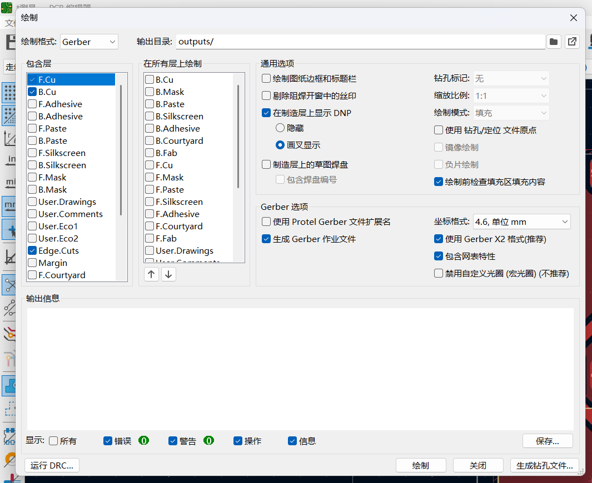
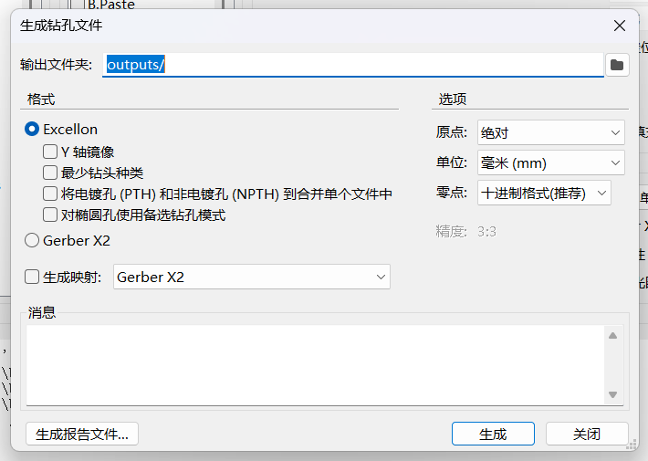

# KiCad

## 导出 Gerber 层文件

打开 **文件（File） → 制造输出（Fabrication Outputs） → Gerbers...**



关键设置：

- **包含的层（Included Layers）** 勾选：
  - `F.Cu`(顶层)
  - `B.Cu`(底层)
  - `Edge.Cuts`(板框层)
- **常规选项（General Options）**:
  - **不**勾选 _Use Extended X2 format_ — 使用 Gerber X1 格式，适配制板机软件
  - 可选勾选 _Use Protel filename extensions_ — 如果你遇到了兼容性问题(虽然笔者从来没遇到过)

设置好后点 **Plot（绘制）** 导出。

## 导出钻孔文件

在同一对话框，点 **Generate Drill Files（生成钻孔文件）**。



关键设置：

- **钻孔文件格式**:`Excellon`
- 其他保持默认

点 **Generate Drill File** 完成。

## 最终输出

假设项目名为 `测量`,输出目录应有这 5 个文件：

```text
测量-B_Cu.gbr       底层
测量-Edge_Cuts.gbr  板框
测量-F_Cu.gbr       顶层
测量-NPTH.drl       非电镀孔
测量-PTH.drl        电镀孔
```
