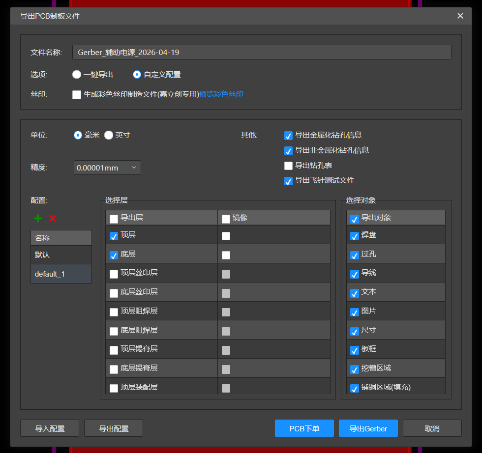

# 立创 EDA

## 导出 Gerber + 钻孔

1. 顶部菜单：**导出 PCB 制板文件**
2. 弹出对话框选 **自定义配置**
3. 点 **导入配置**,选择下面的配置文件
4. 选择模板 **default_1**
5. 点 **导出 Gerber**

配置文件：<a href="./立创eda-gerber.json" download>立创eda-gerber.json</a>(点击下载)

## 挑出需要的文件

立创 EDA 下载下来的是一个压缩包，解压后共 6 个文件——我们只需要其中 **4 个**:

| 文件 | 是否需要 | 说明 |
|------|---------|------|
| `Drill_PTH_Through.DRL` | ✅ | 钻孔 |
| `Gerber_BoardOutlineLayer.GKO` | ✅ | 板框 |
| `Gerber_BottomLayer.GBL` | ✅ | 底层铜 |
| `Gerber_TopLayer.GTL` | ✅ | 顶层铜 |
| `FlyingProbeTesting.json` | ❌ | 飞针测试，制板机不用 |
| `PCB下单必读.txt` | ❌ | 嘉立创下单说明 |

把 4 个需要的文件留下，其余可以删。
