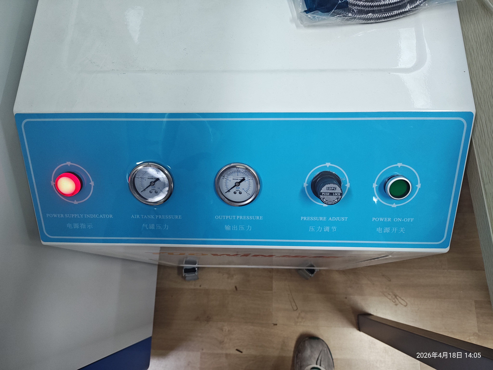

# 3. 打开气泵电源

按气泵**面板右侧的绿色电源开关**,开启后电源指示灯点亮。



```admonish danger title="不要动压力调节按钮"
气泵面板上的**压力调节按钮**已经根据制板机所需压力调好——**请勿更改**。
```

```admonish warning title="气泵会周期性排气，巨响"
气泵在充气完成后，**每隔约 10 分钟会自动排气一次**,发出**相当大的声音**——事先做好心理准备，别被吓到。
```
