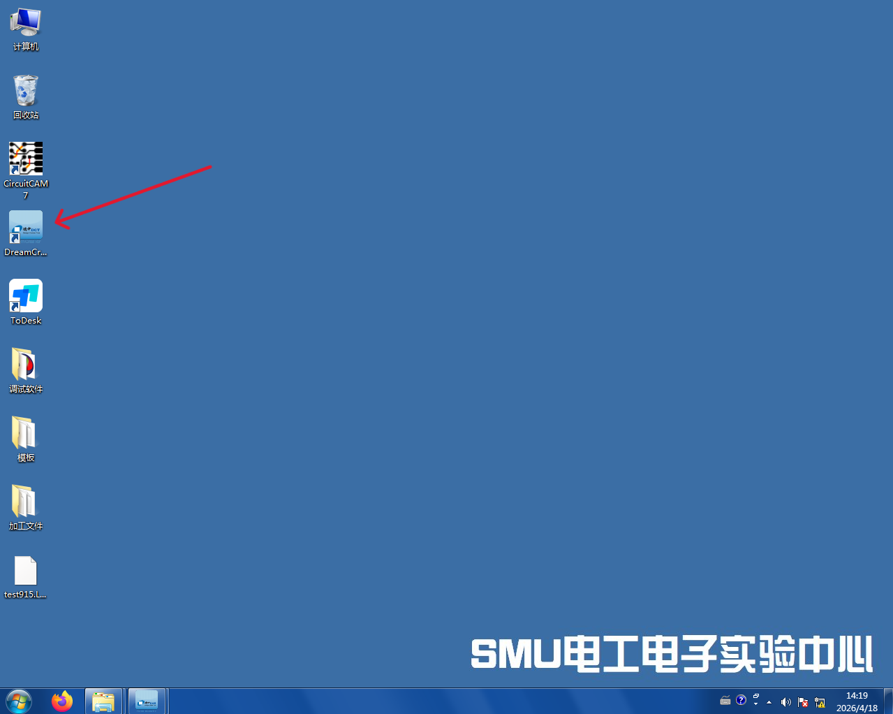
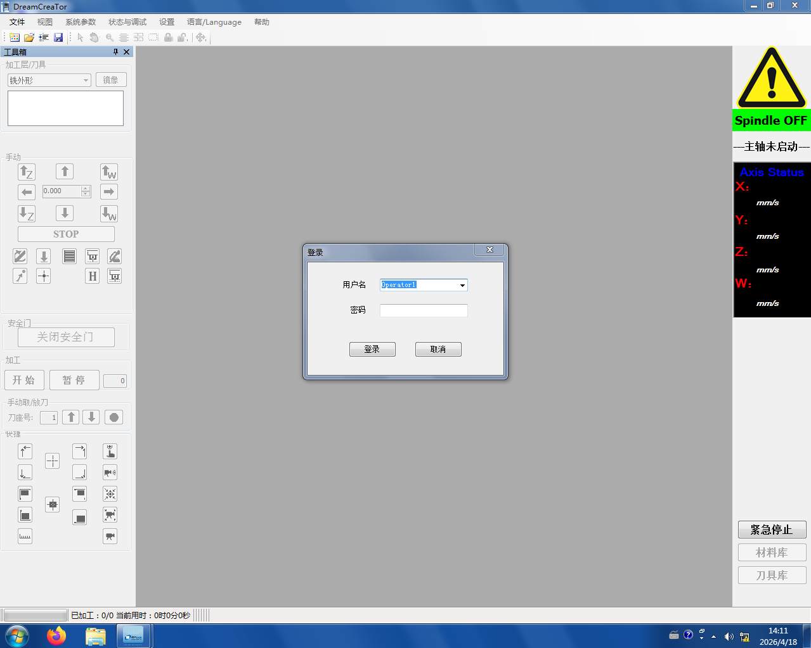
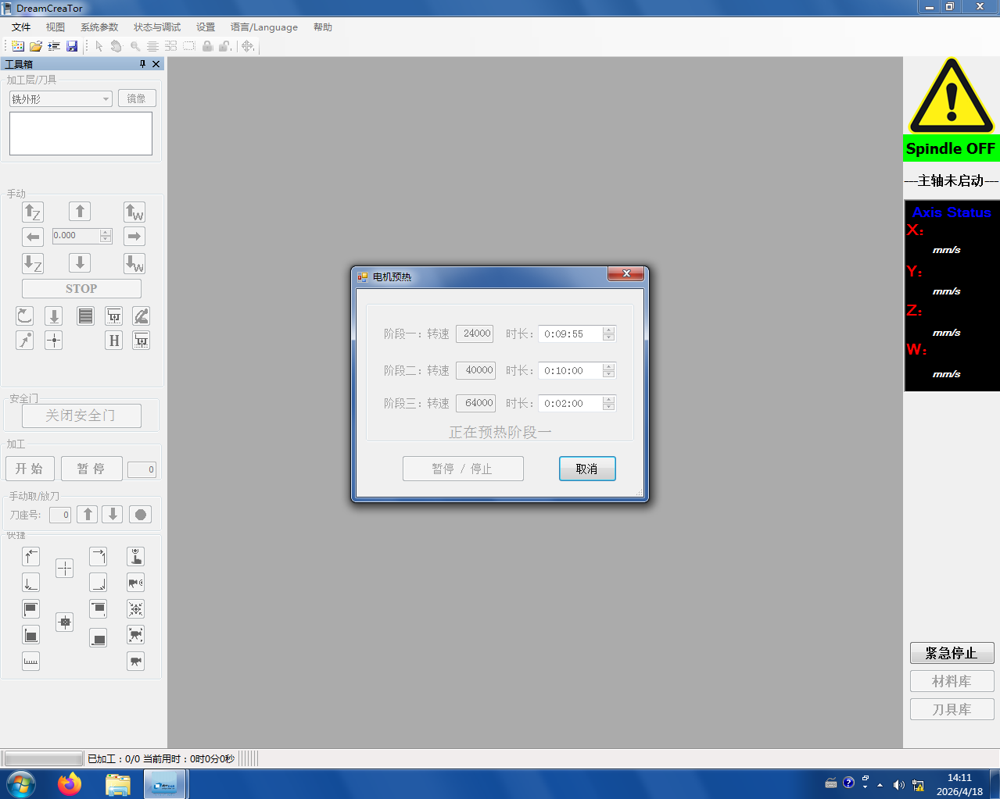
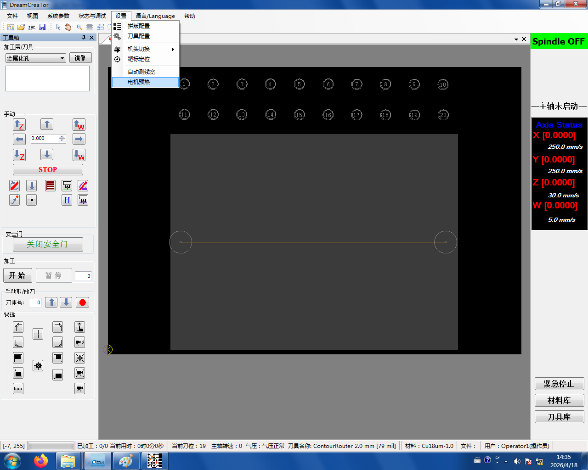

# 5. 预热

```admonish warning title="预热前检查"
开始预热前确认：

- DM350 机床**已通电**(上一步完成)
- **气泵已连接并开机**,气管正常供气
```

启动软件并开始预热：

1. 打开电脑上的 **Dream Creator** 软件

   

2. 点击 **登录**

   

3. 登录后会弹出**预热窗口**,自动开始预热（约 25 分钟）

   

```admonish tip title="不用干等"
预热要约 25 分钟。这段时间请同步去做[第 1 步：导出 Gerber](../01-export-gerber.md)和[第 3 步：刀路计算](../03-toolpath.md),等预热结束再回来继续。
```

```admonish tip title="电机预热没有自动弹出？" collapsible=true
**只有每日第一次**打开机器时才会自动弹出预热界面。如果今天已经开过机，自动预热不会再弹出——这时需要手动进入预热：

**[新建项目](../04-setup.md#new-project) → 设置 → 电机预热**


```
