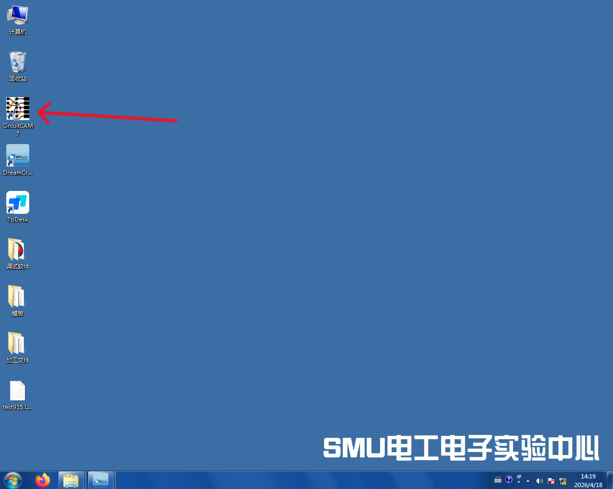
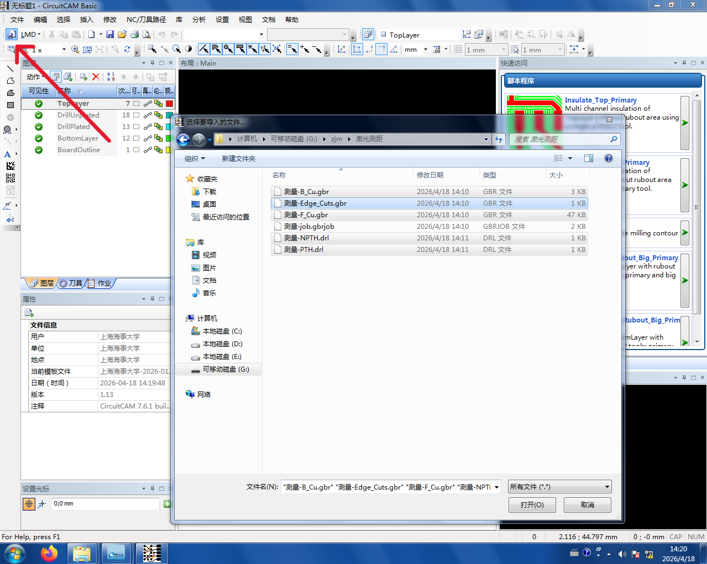
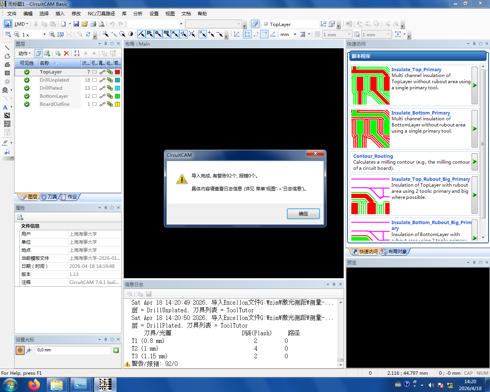
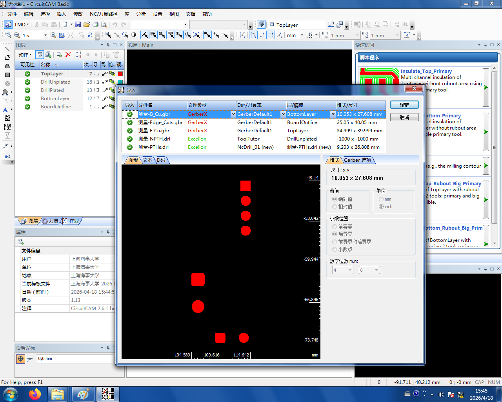
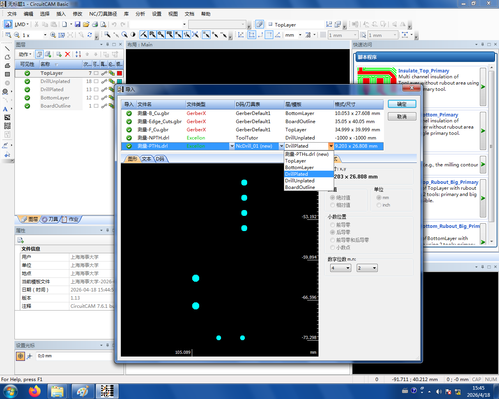
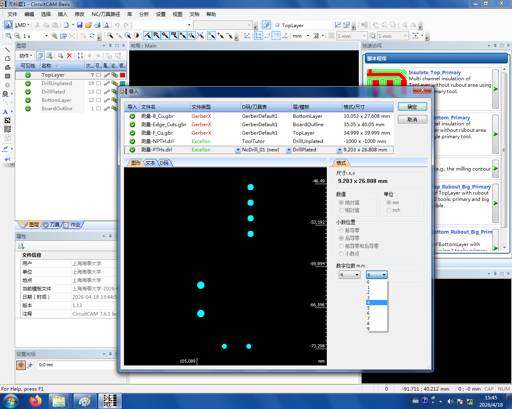

# 1. 导入 Gerber

把 [导出 Gerber](../01-export-gerber.md) 得到的文件用 **U 盘**拷到制板机旁边的电脑上：


打开电脑上的 **CircuitCam7** 软件：



点击**导入按钮**,选中刚才拷过来的文件——**只导入需要的 5 个文件**,压缩包里其他东西不要导进来：



模板已经做过适配，正常情况下会直接显示**导入成功**。弹出的警告不用理会：



```admonish tip title="导入失败，弹出手动导入窗口？" collapsible=true
如果 [导出 Gerber](../01-export-gerber.md) 时没按教程操作，或者 EDA 软件更新后默认导出参数变了，可能会弹出手动导入界面：



不用担心，**根据文件性质选对应的模板**即可：



| 你手里的文件 | 选这个模板 |
|------------|----------|
| 顶层（F.Cu / TopLayer / `.GTL`） | `TopLayer` |
| 底层（B.Cu / BottomLayer / `.GBL`） | `BottomLayer` |
| 电镀孔（PTH / `.DRL`） | `DrillPlated` |
| 机械孔（NPTH） | `DrillUnplated` |
| 板框（Edge.Cuts / `.GKO`） | `BoardOutline` |
```

```admonish tip title="手动导入后通孔位置不对？" collapsible=true
你大概率在用 **Altium Designer**。在手动导入对话框的**格式（Format）**位置改**数字位数**即可。

AD 默认应该是 **4 / 2**:


```
