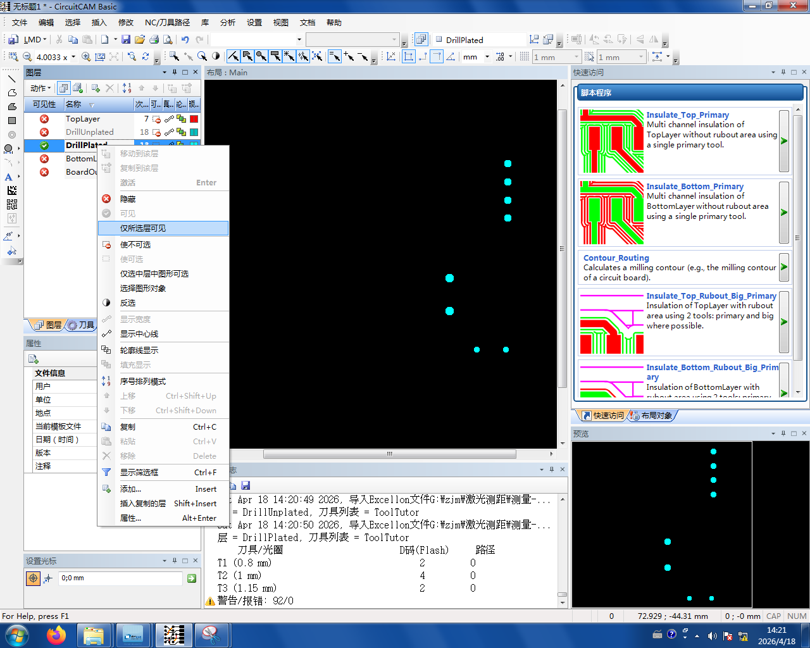
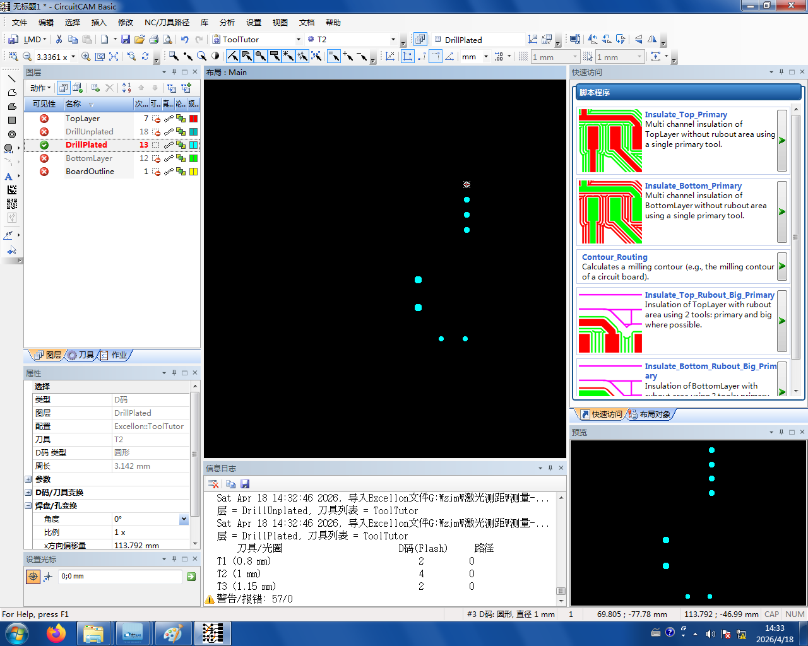
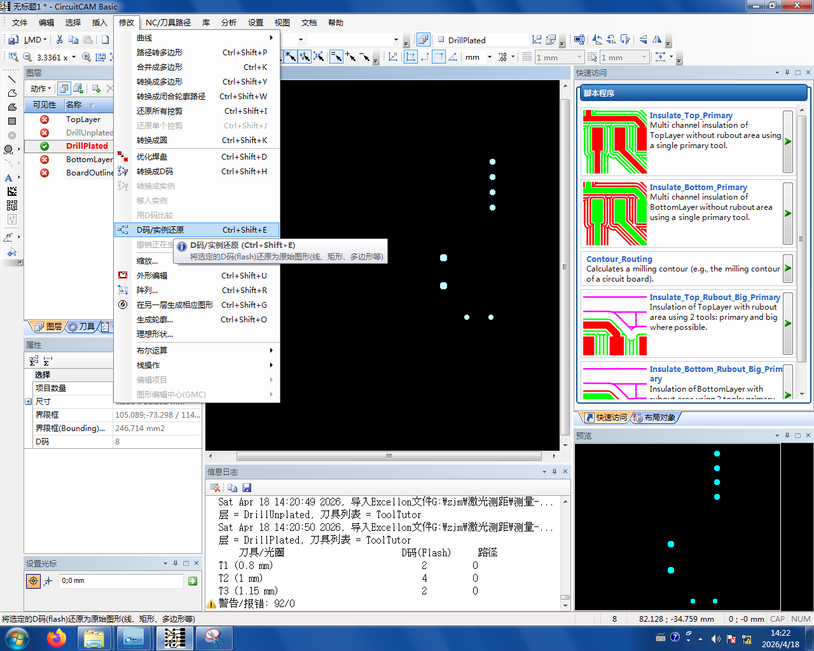
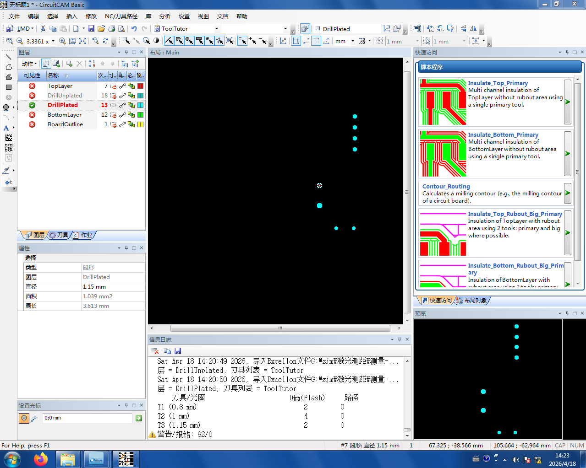

# 2. 通孔 D 码还原

导入后要对电镀孔层做一次"D 码还原",否则软件会**用铣刀模拟钻孔**,而不是真正用钻头打孔。

```admonish tip title="D 码还原是做什么的？" collapsible=true
导入后，通孔层的元素默认被识别为**走线**,CircuitCam 会分配**铣刀**按走线的方式去"走"一遍孔，既慢又打不穿。

D 码还原把这些元素重新识别成**真正的钻孔**,这样后续生成刀路时会用**钻头**直接打孔。
```

操作步骤：

1. 在左侧图层菜单里选中 **DrillPlated**(电镀孔层)，**右键** → **仅所选可见**

   

2. 画布中间会只剩下一堆**圆形**。**任意点一个**,在**左下角属性栏**里可以看到它被识别为 **D 码**

   

3. **鼠标框选全选**所有这些圆形 → 菜单 **修改（Modify） → D 码/实例还原**

   

4. 还原后任意再点一个元素，属性栏显示为**圆形（Circle）**——说明还原成功

   
