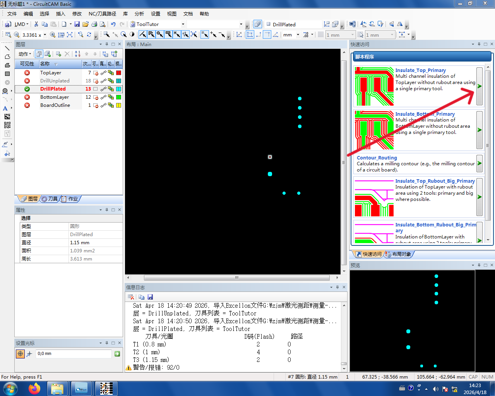
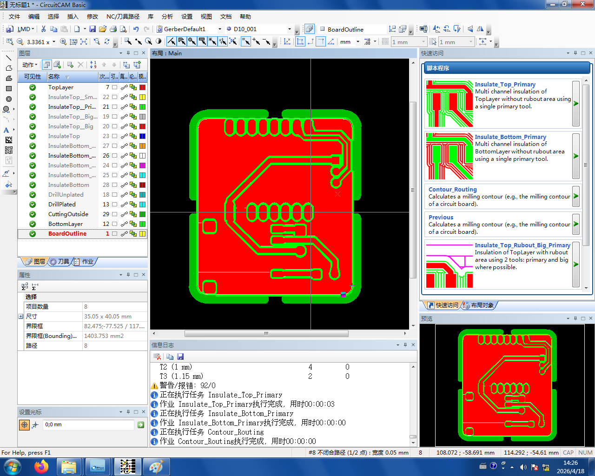
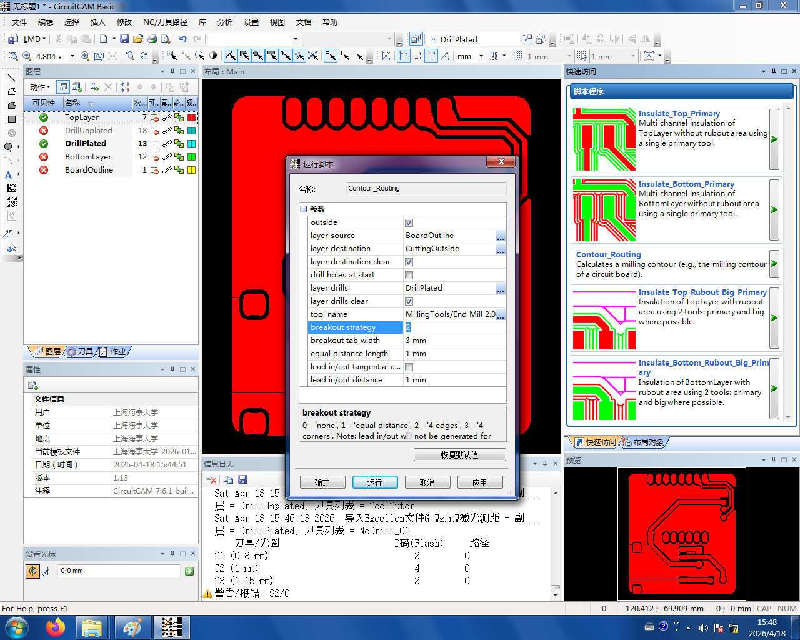

# 3. 计算刀路 {#calc-toolpath}

右侧工具栏的三个箭头按钮分别负责计算顶层 / 底层 / 边框的刀路。**依次点击这三个按钮**:



1. **第一个按钮**:计算**顶层**刀路
2. **第二个按钮**:计算**底层**刀路
3. **第三个按钮**:计算**边框**(Edge.Cuts) 铣切路径

全部完成后，图层应该变成下图这样：



```admonish tip title="脚本参数与选择" collapsible=true
### 两种点击方式

- 点击**绿色三角**:按默认参数**快速执行**
- 点击**脚本图标本身**:进入**参数修改界面**

顶层 / 底层脚本的默认参数**一般不用改**。边框脚本（`Contour_Routing`）的 `breakout strategy` 参数可以按需调整：



| 值 | 含义 |
|---|------|
| `0` | 无 breakout |
| `1` | 全部切断 —— 板子会直接脱落，**不推荐** |
| `2` | **默认** —— 中间留 4 处连接 |
| `3` | 留 4 个角作为连接 |

### 可选脚本

| 脚本 | 用途 |
|------|------|
| `Insulate_Top_Primary` | **默认**:用 0.2 mm 刀算**顶层**刀路 |
| `Insulate_Bottom_Primary` | **默认**:同上，**底层** |
| `Contour_Routing` | 切**边框** |
| `Insulate_Top_Rubout_Big_Primary` | **顶层**:2.0 mm 大刀粗铣 + 0.2 mm 小刀精修（去死铜用） |
| `Insulate_Bottom_Rubout_Big_Primary` | 同上，**底层** |

带 `Rubout_Big` 的粗铣脚本用时更长，精度略低——默认不使用。**只有在不保留死铜时**才建议切换过去，详见[建议 4：尽量保留死铜](../00-prepare-pcb/tips.md#tip-4)。
```
