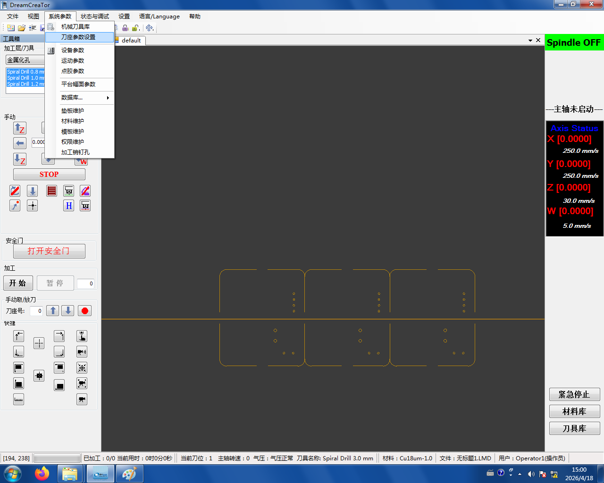
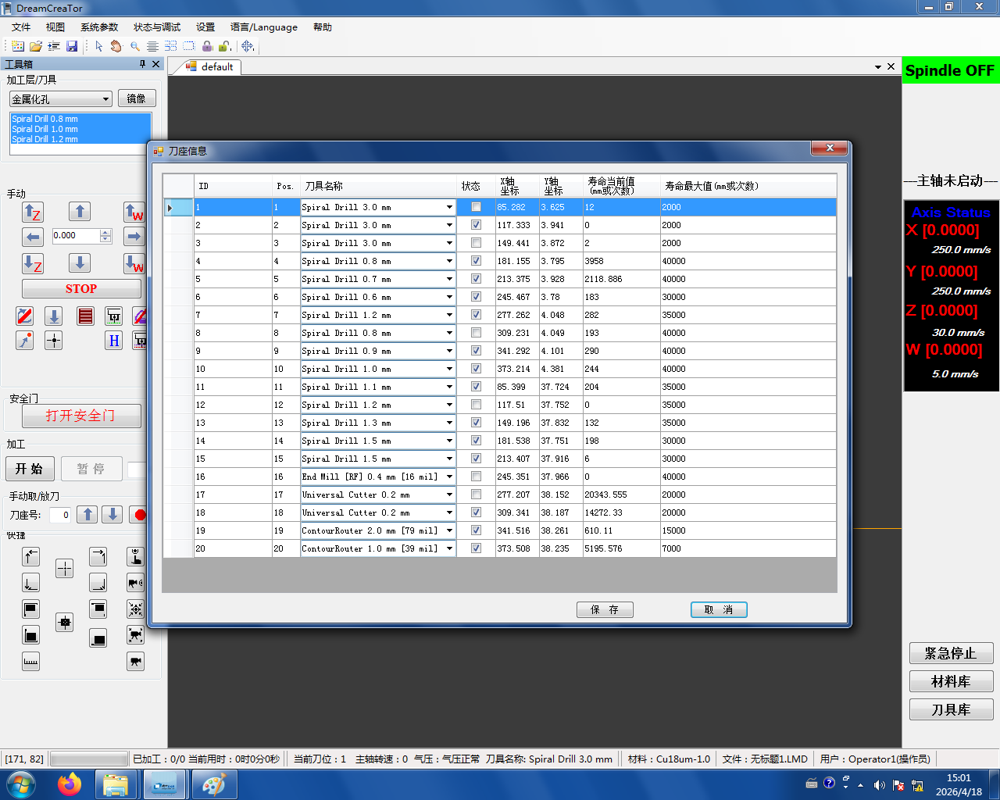
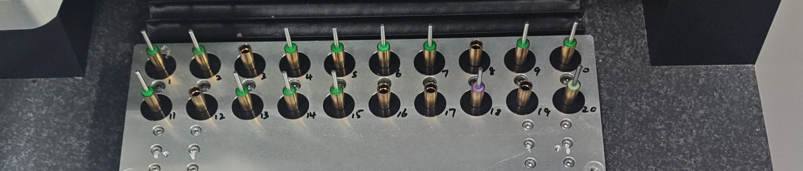

# 0. 启动前的安全检查（必读） {#before-start}

```admonish danger title="每次按下启动前都要过一遍这一节"
制板机最常见的故障是**撞刀**——刀具和销钉、铜板、夹具等意外碰撞。

- **全程不能离开**:机器旁边放了椅子，就是让你坐在那盯着它的
- **异常立刻急停**:出现异响、火花或任何异常时，第一时间按下急停按钮
- **适用于所有切削动作**:包括本章后面的"加工销钉孔",也包括 [正式制板](../05-milling.md) 里的所有切削步骤
```

## 检查刀具信息

正式启动前先确认软件里的刀座状态和机床里的实际刀具**一致**(一般都对，但要过一眼)。

点 **系统参数 → 刀座参数设置**:



在弹出的界面里检查每个刀位——**打勾 = 该位置有刀，没打勾 = 没刀**,必须与机床中的真实情况一一对应：



对照机床刀架实物：



确认无误后才能进行下一步。
