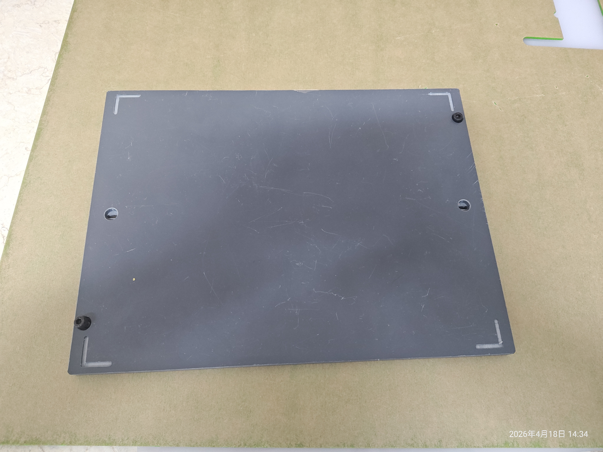
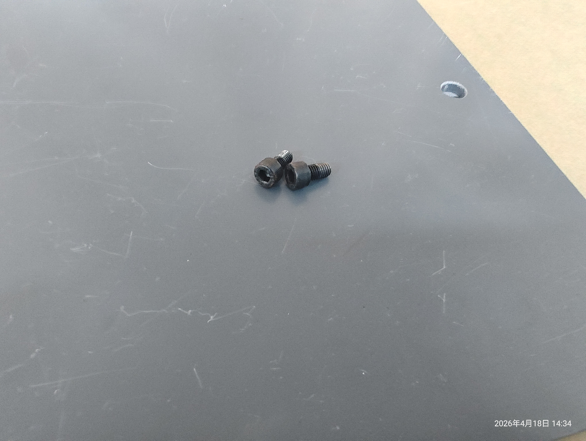
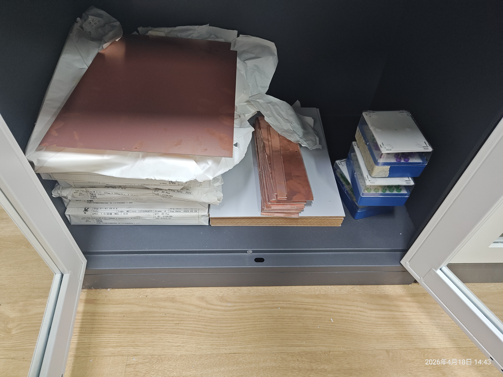
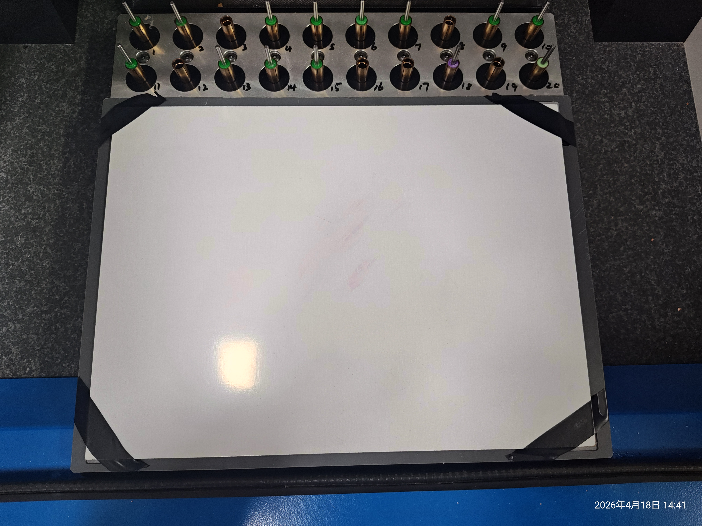
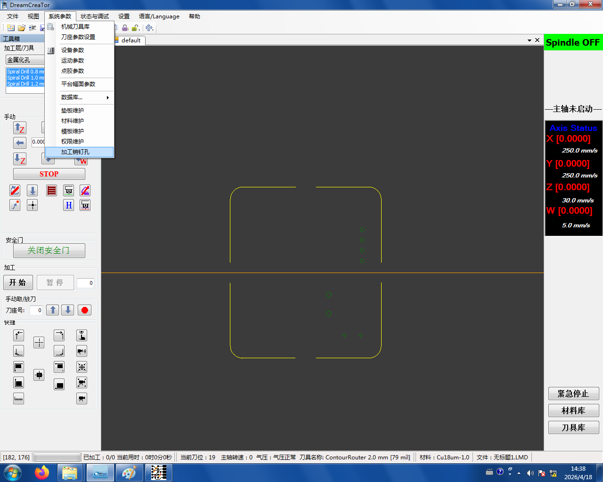
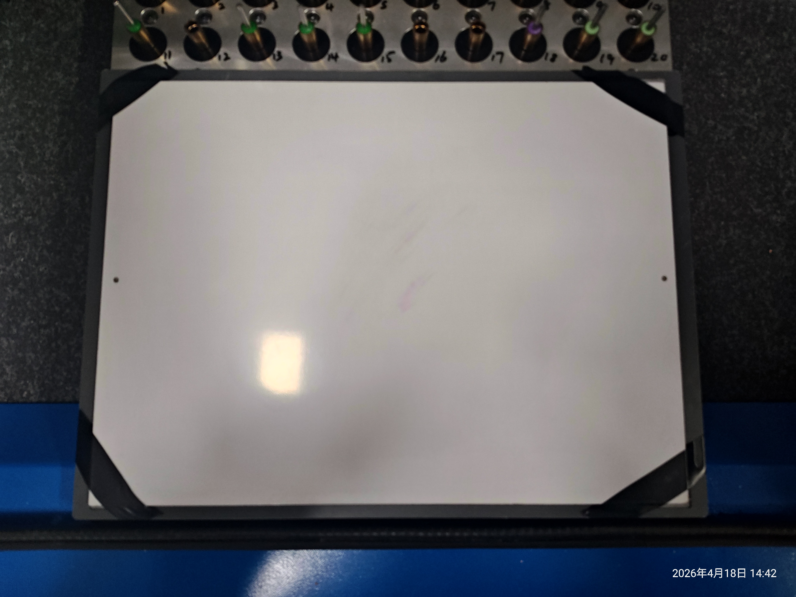
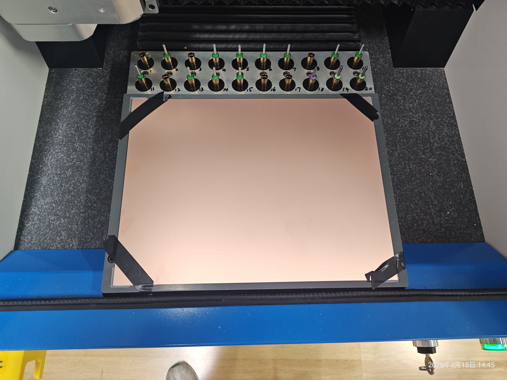

# 2. 制作垫板

## 2.1 固定垫板

从**窗台**取下垫板、配套螺丝和六角扳手：




用螺丝把垫板**固定到制板机工作台**上：


## 2.2 粘贴纸板

从 **16 号柜**取双面敷铜板和纸板：



把**纸板按垫板的位置**,用胶带粘在垫板上：



```admonish note title="为什么要垫纸板？"
钻孔和铣边框的刀具会**钻穿铜板**——如果下面没东西挡着，刀会直接打到工作台基座，损伤机器。纸板就是用来承接这些钻穿的刀的"牺牲品"。
```

```admonish tip title="纸板可以重复使用"
用过的纸板不用扔。加工完板子后撕下来放回窗台，下次可以继续用。去用之前先去**窗台**上找找，有没有别人留下的"野生"纸板。
```

## 2.3 加工销钉孔（垫板 + 纸板）

```admonish danger title="开动前看这里：全程盯着，随时按急停"
从这一步开始，制板机就要**真正开始切削**了。制板机最常见的故障是**撞刀**——按下启动前请先阅读 [启动前的安全检查](./00-safety-check.md),那边讲了安全事项和刀具信息检查。
```

在软件里点 **系统参数 → 加工销钉孔**,开始加工：



加工完成后，垫板和纸板的**两侧**会出现销钉孔：



```admonish tip title="销钉孔没戳穿纸板？" collapsible=true
纸板较厚，刀具一次可能扎不到底。两种解决办法：

- **在纸板下再垫两张 A4 纸**,增加软性缓冲，一次就能戳穿
- **不要撕掉胶带**,把纸板再对准粘一次，然后重新加工一遍
```

## 2.4 给铜板加工销钉孔

把**双面敷铜板**放到垫板上方，用**同样的方法**加工销钉孔——铜板两侧也会有对应的销钉孔：


