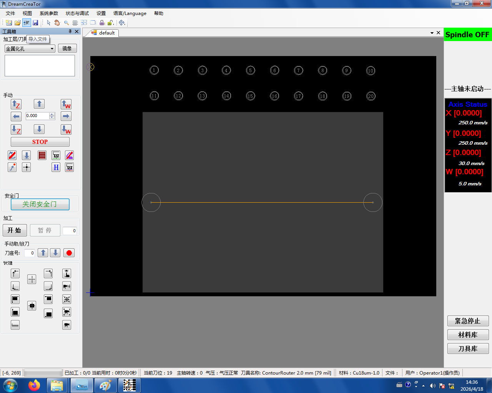
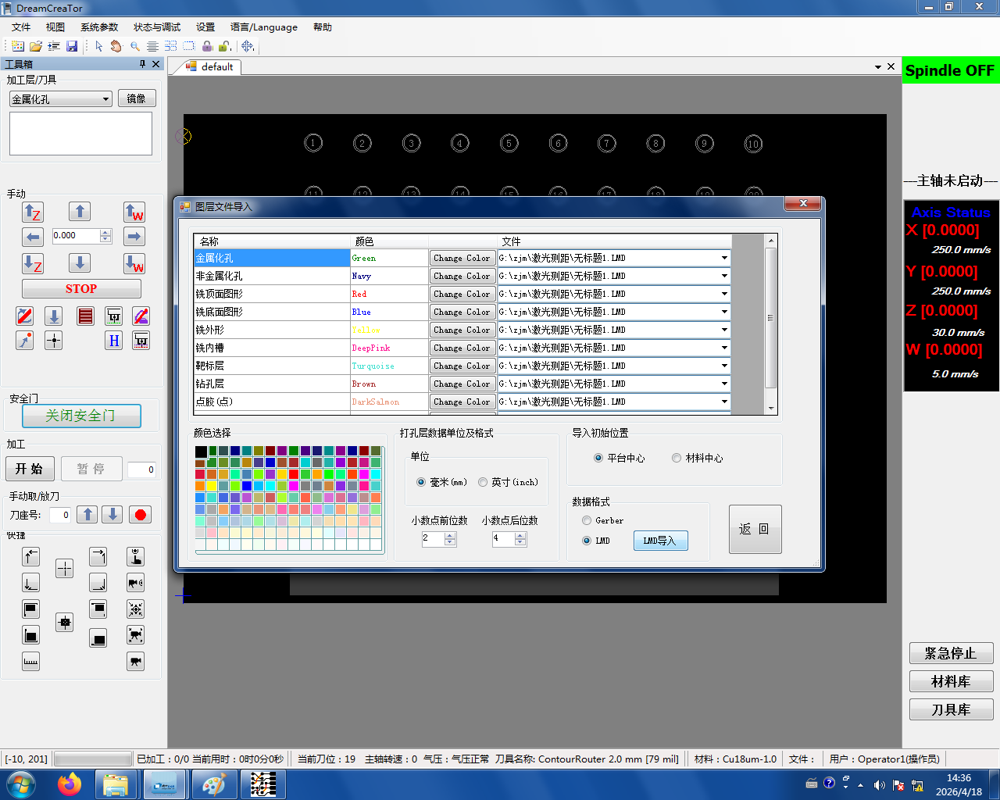
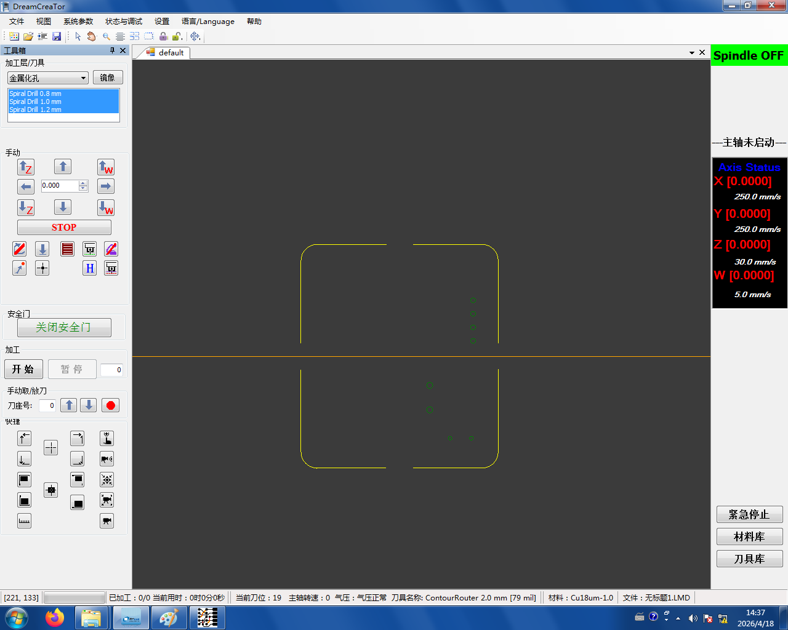

# 4. 导入刀路

把 [保存好的 LMD 文件](../03-toolpath/04-save-lmd.md) 导入 Dream Creator。

1. 点击 **导入文件**

   

2. 在弹出的窗口中点击 **LMD 导入**,选中刚才保存的 LMD 文件，然后点 **返回**

   

导入成功后，画布上的**加工层**会出现刀具，板子中间也能看到**通孔**位置——说明刀路已正确载入。

