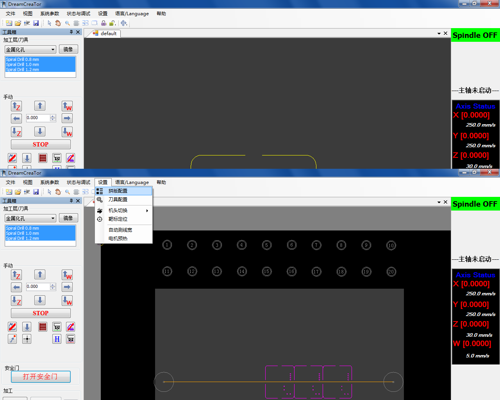

# 5. 拼板（可选）

如果要在一张铜板上加工多块相同的小板，可以用 Dream Creator 的**拼板**功能。

1. 点击 **设置 → 拼板设置**

   

2. 填入合适的**行数和列数**,软件会自动生成拼板布局

```admonish warning title="别设得太多"
拼板数量设置过多，软件会**卡死**。先从小数量试起（比如 2×2），确认没问题再加。
```
