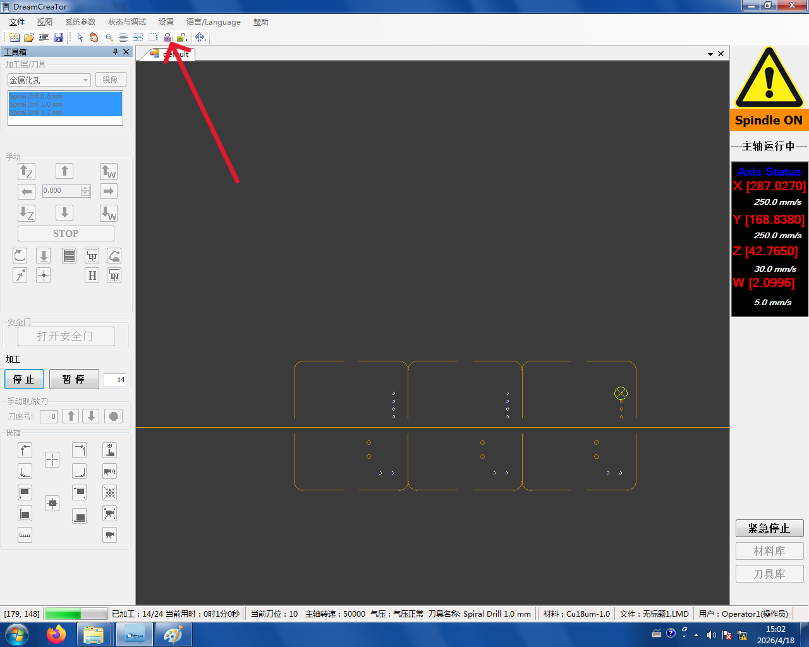
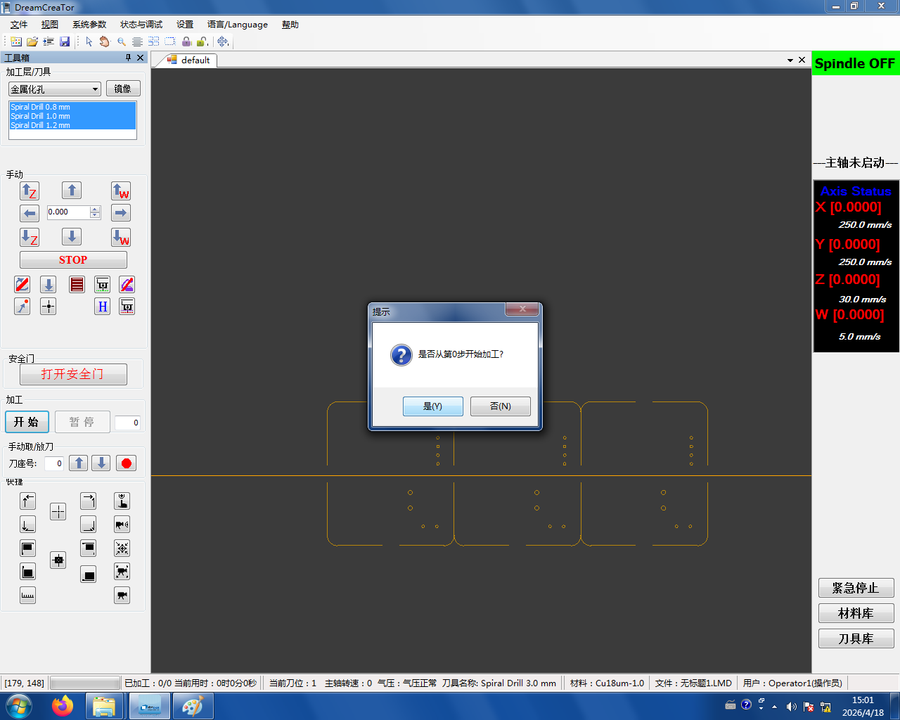

# 1. 钻孔

钻孔分两类：**金属化孔（PTH）** 和 **非金属化孔（NPTH）**。先钻完金属化，再钻非金属化（如果有），之后选中**顶面图形**准备铣正面走线。

1. **工具箱**下选择 **金属化孔**
2. 在主界面**全选**所有内容 → 点 **锁**图标锁定

   

3. 点 **开始加工**,选择**从第 0 步开始**

   

4. 金属化孔加工完后，**工具箱**选择 **非金属化孔**,同样方式加工（如果 PCB 里没有 NPTH 就跳过这一步）
5. 两类钻孔完成后，**工具箱**选择 **铣顶面图形**,准备铣正面走线

```admonish warning title="每换一个加工对象都要重新锁"
不只是钻孔——**金属化孔、非金属化孔、铣正面、铣反面、铣边框**,每次切换到下一个加工对象后都要重新 **全选 + 点锁图标**,再点开始加工。忘记锁会导致刀路错乱或加工错对象。
```
