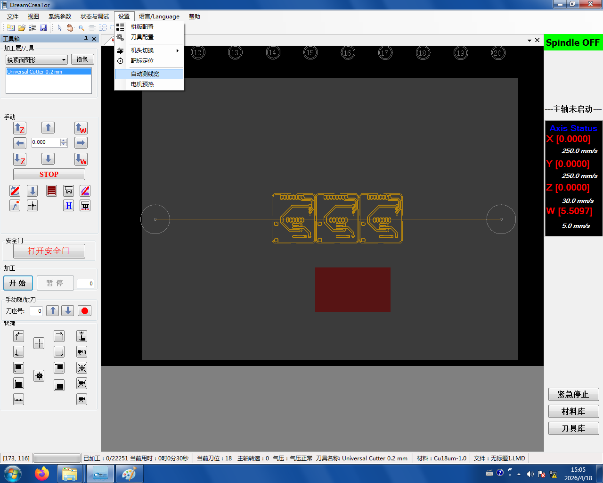
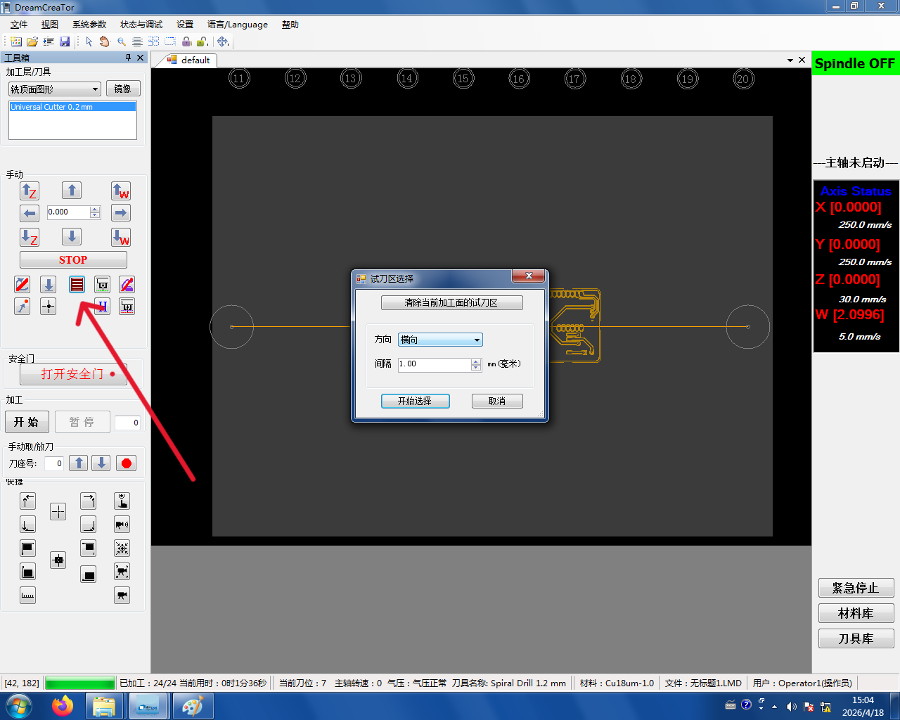
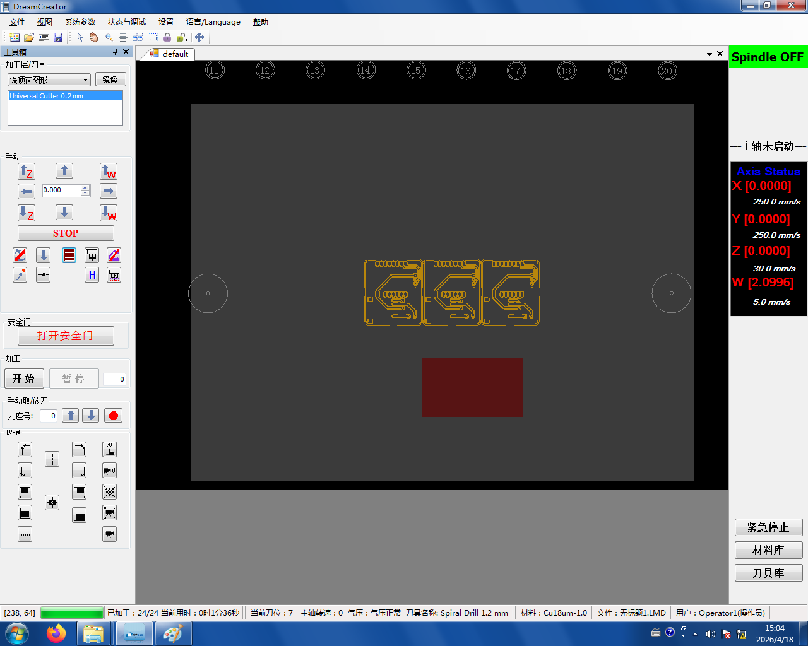
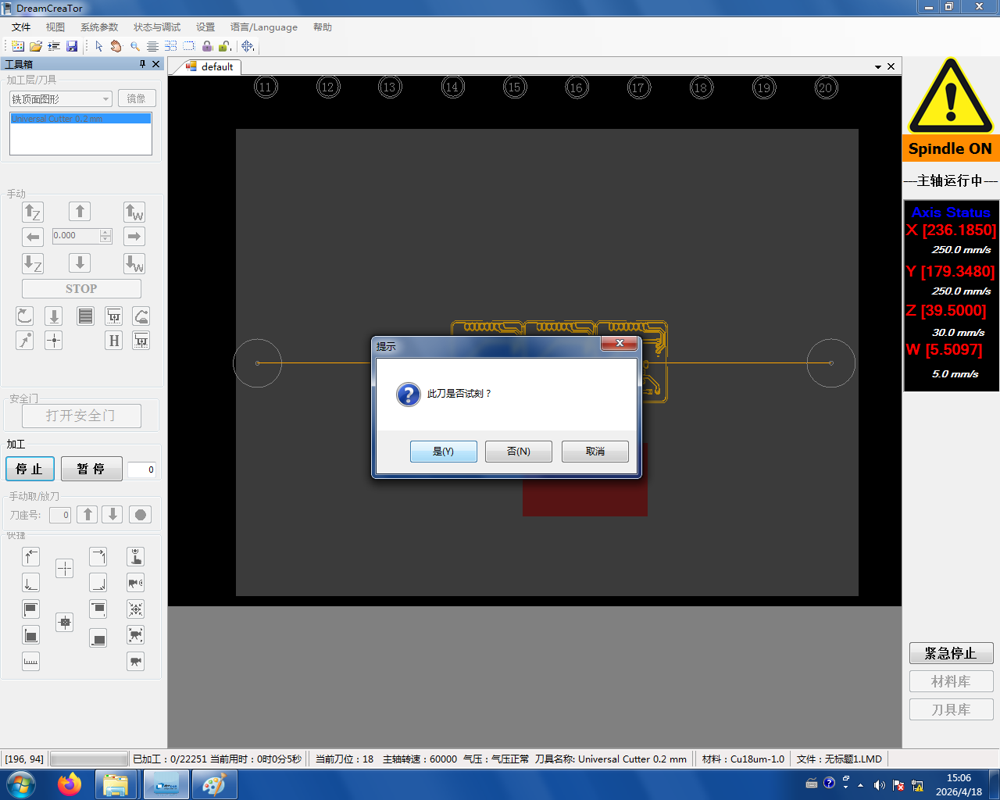
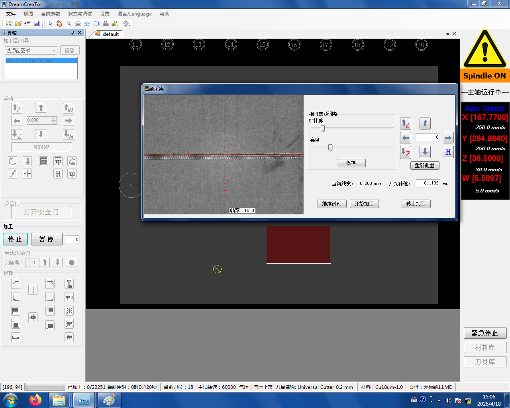
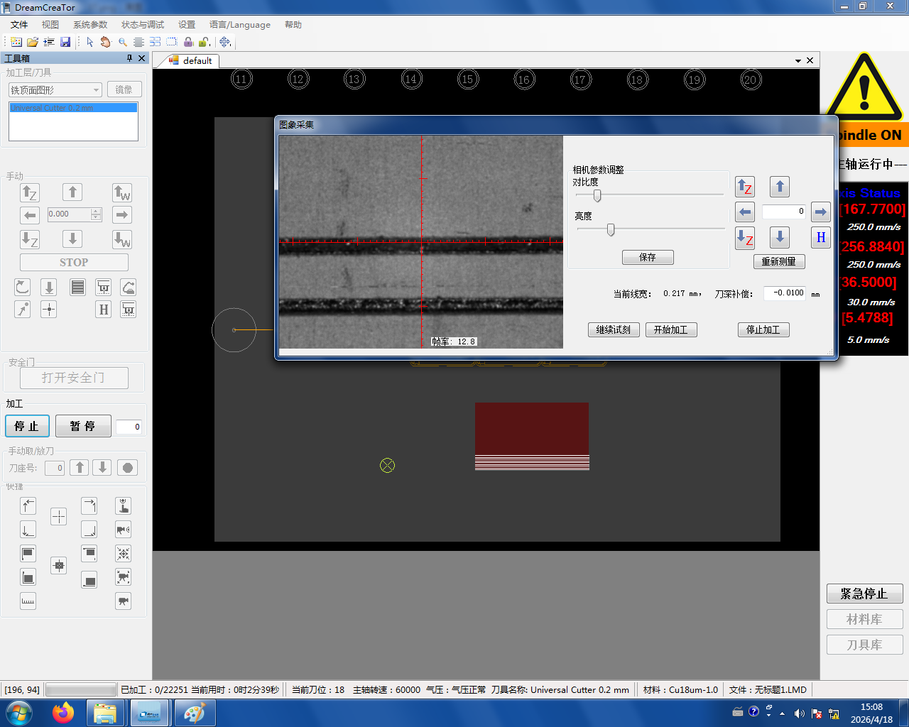

# 2. 试刀

```admonish tip title="为什么要试刻？" collapsible=true
我们用的 0.2 mm 铣刀刀头是**三角形**的——下刀越深，切出来的槽口就越宽：

- 刀深**过浅**:铜皮没切断，两条走线还会**连在一起**(短路)
- 刀深**过深**:切到板子底部，**铣穿基材**,背面铜层也跟着废了

不同铜箔厚度、不同刀具状态下的最佳刀深都不一样，必须在正式开工前**试刻**几次确定合适深度。试刻时要**同时看摄像头画面和实际板面**,两者结合判断。
```

## 2.1 开启摄像头检测

点 **设置 → 自动测线宽**,开启**摄像头检测**:



## 2.2 选择试刀区

点**红色按钮**,进入"试刀区开始选择"模式：



在主界面**框选一块空白区域**作为试刀区：



## 2.3 试刻并调整刀深

点 **开始**,选择 **试刻**:



进入试刻界面后，通过修改**刀深补偿**来调整——**一般用自动即可**:



**多次试刻**,直到线宽接近 **0.2 mm**(使用的刀具直径)为止：


