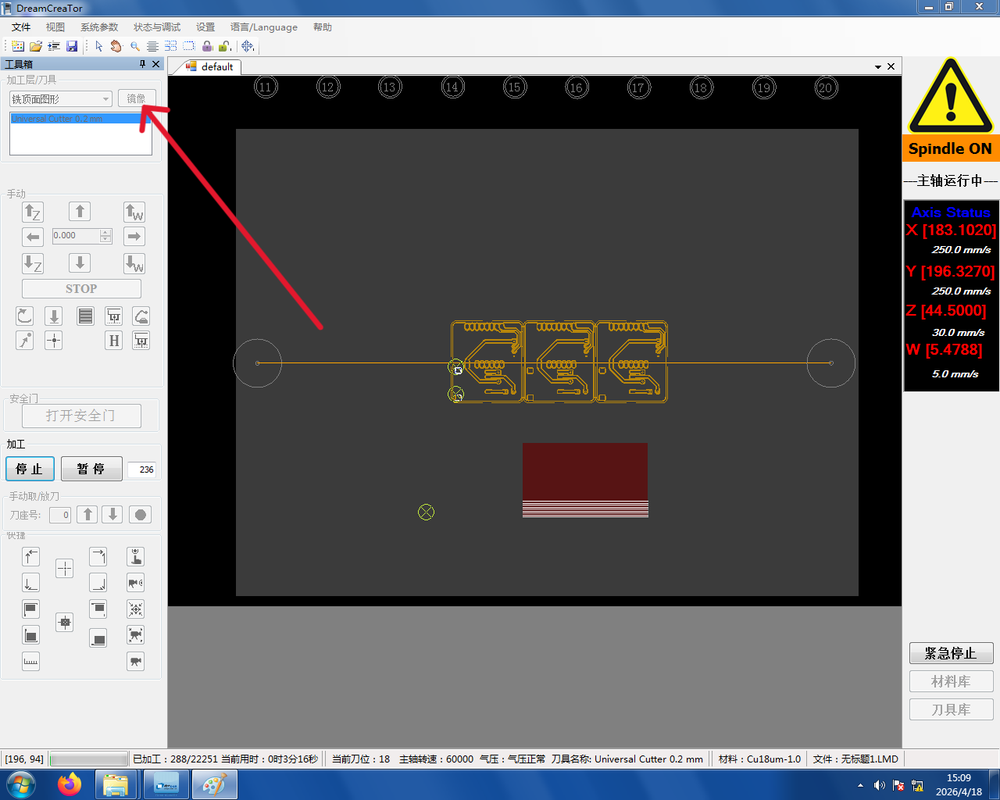

# 5. 铣边框

正反面都铣完后，**工具箱**选择 **铣边框**,即可开始加工板子轮廓。

```admonish warning title="反面铣边框必须先镜像"
如果铣边框时铜板是**反面朝上**(也就是接着上一步做完直接铣)，必须点**镜像按钮**把边框**上下翻转**——这样铣出来的轮廓才会和反面板子对齐。



否则边框会和实际板子位置对不上，整块板就废了。
```

边框切完的成品：


