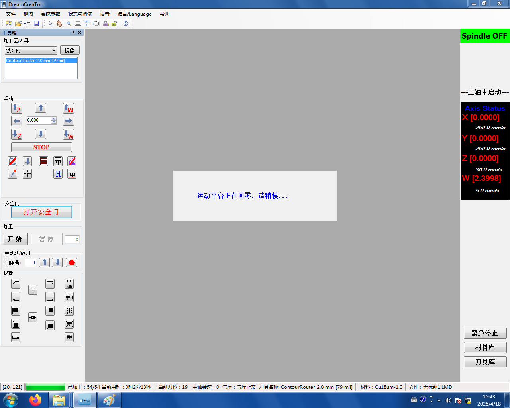

# 1. 关闭软件与电脑

## 1.1 关闭 Dream Creator 并复位设备

在 Dream Creator 里选择**复位设备**后再关闭软件：



```admonish warning title="关机时主轴里要有一把刀"
关机前确认**刀咀里必须含有一把刀**——一般正常加工结束时主轴上都会留有最后一把刀，无需额外操作，但如果因为急停等原因中断过流程，要手动把刀放回去再关机。
```

## 1.2 关闭电脑

软件关闭后，正常 **Windows 关机**。
