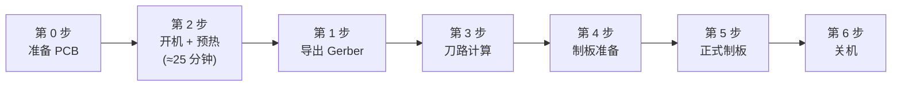

# 简介

## 本教程是什么

## 适用对象

## 设备信息（DM350）

## 整体流程

本教程按照章节顺序排列内容，但**实际操作顺序**并非从第 0 步顺序执行到第 6 步。因为设备预热（第 2 步）需要约 25 分钟，通常在开机预热的同时进行 Gerber 导出（第 1 步）以节省时间。



```admonish tip title="时间利用建议"
第 2 步开始预热后，机器会自行加热约 25 分钟，这段时间请同步进行第 1 步（导出 Gerber），充分利用等待时间。
```
